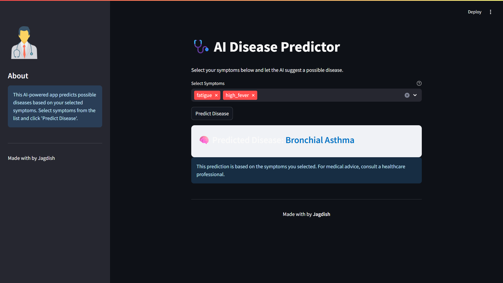

# 🩺 AI Disease Predictor

An AI-powered web application that predicts possible diseases based on user-selected symptoms. Built with Python, Streamlit, and scikit-learn, this project demonstrates machine learning for healthcare assistance.

---

## 🚀 Features

- **Symptom-based Disease Prediction:** Select symptoms and get instant predictions.
- **Interactive UI:** Clean, modern interface built with Streamlit.
- **Model Performance Metrics:** View accuracy, classification report, and F1-score charts.
- **Customizable:** Easily retrain with your own dataset.

---

## 🛠️ Tech Stack

- **Frontend:** Streamlit
- **Backend/ML:** Python, scikit-learn, pandas, numpy
- **Model:** RandomForestClassifier (with hyperparameter tuning)
- **Visualization:** matplotlib, pandas

---

## 📦 Setup & Usage

1. **Clone the repository:**
    ```bash
    git clone https://github.com/yourusername/ai-disease-predictor.git
    cd ai-disease-predictor/ML
    ```

2. **Install dependencies:**
    ```bash
    pip install -r requirements.txt
    ```

3. **Prepare your dataset:**
    - Place your CSV file in `data/dataset.csv`
    - Format: First column = Disease, remaining columns = Symptoms

4. **Train the model:**
    ```bash
    python notebooks/model.ipynb
    ```
    *(Or run all cells in Jupyter Notebook)*

5. **Run the Streamlit app:**
    ```bash
    streamlit run streamlit_app/streamlit_app/app.py
    ```

---

## 🖥️ UI Demo


---

## 🤝 Contributing

Pull requests and suggestions are welcome!  
Feel free to open issues for bugs or feature requests.

---
